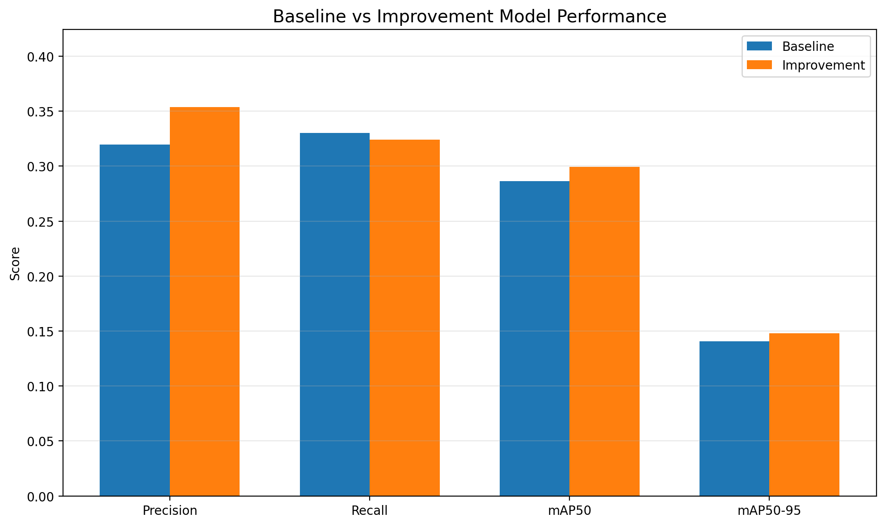
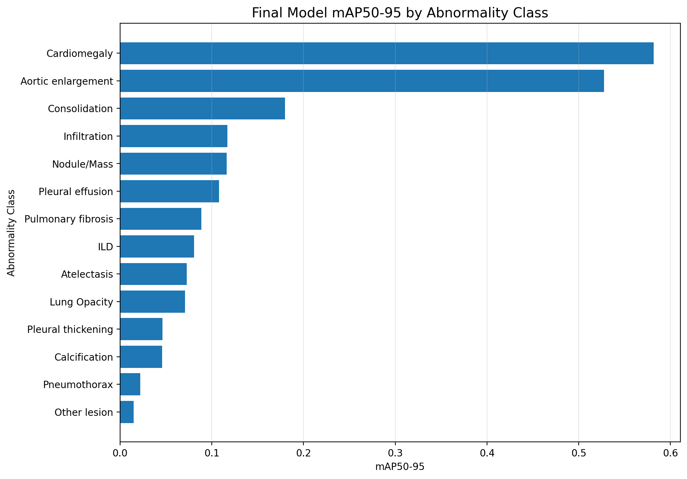
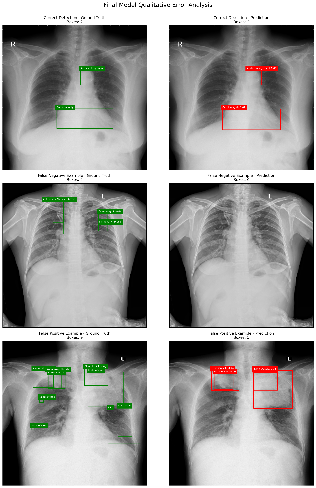

# YOLOv8 기반 흉부 X-ray 이상 소견 탐지

VinBigData 흉부 X-ray 데이터를 이용하여 14종의 이상 소견과 위치를 탐지한 객체탐지 프로젝트입니다.

YOLOv8s 전이학습 모델을 기반으로 원본 Annotation의 중복 Bounding Box 문제를 분석하고, IoU 기반 Consensus Bounding Box를 생성하여 Baseline 모델과 개선 모델의 성능을 비교했습니다.

---

## 프로젝트 개요

흉부 X-ray 한 장에는 여러 이상 소견이 동시에 존재할 수 있습니다.

본 프로젝트에서는 이미지 전체를 하나의 클래스로 분류하는 것이 아니라, 다음 정보를 함께 예측하는 객체탐지 모델을 구현했습니다.

```text
이상 소견의 종류
+
이상 소견의 위치
+
예측 신뢰도
```

전체 프로젝트 흐름은 다음과 같습니다.

```text
데이터 불러오기 및 구조 확인
        ↓
정상·비정상 및 클래스 분포 분석
        ↓
Train / Validation 분할
        ↓
Bounding Box를 YOLO 형식으로 변환
        ↓
YOLOv8s Baseline 학습
        ↓
중복 Bounding Box 통합
        ↓
YOLOv8s Improvement 학습
        ↓
동일한 Validation 기준으로 모델 비교
        ↓
클래스별 성능 분석
        ↓
False Positive / False Negative 오류 분석
```

---

## 프로젝트 목표

- 흉부 X-ray에서 14종 이상 소견 탐지
- 병변의 종류와 위치를 Bounding Box로 예측
- 다중 판독으로 발생한 중복 Annotation 분석
- IoU 기반 Consensus Bounding Box 생성
- Baseline과 개선 모델의 공정한 성능 비교
- 클래스별 탐지 성능 분석
- 정탐·오탐·미탐 사례의 정성적 분석
- 의료영상 객체탐지 전체 파이프라인 구현

---

## 데이터셋

### 원본 데이터

```text
VinBigData Chest X-ray Abnormalities Detection
```

### 프로젝트에서 사용한 버전

```text
Kaggle Dataset:
awsaf49/vinbigdata-512-image-dataset
```

원본 DICOM을 직접 사용하지 않고, 모델 학습 속도와 처리 편의성을 위해 `512 × 512 PNG`로 변환된 커뮤니티 데이터셋을 사용했습니다.

### 데이터 구성

| 항목 | 개수 |
|---|---:|
| 전체 Train 이미지 | 15,000 |
| 정상 이미지 | 10,606 |
| 비정상 이미지 | 4,394 |
| 정상 이미지 비율 | 70.71% |
| 비정상 이미지 비율 | 29.29% |
| 탐지 대상 클래스 | 14개 |
| 원본 Bounding Box | 36,096개 |
| Test 이미지 | 3,000 |

정상 이미지에는 탐지 대상 Bounding Box가 없으며, YOLO 데이터셋에서는 비어 있는 Label 파일로 처리했습니다.

---

## 탐지 클래스

`No finding`은 탐지 대상에서 제외하고 다음 14종의 이상 소견을 탐지했습니다.

| Class ID | 이상 소견 |
|---:|---|
| 0 | Aortic enlargement |
| 1 | Atelectasis |
| 2 | Calcification |
| 3 | Cardiomegaly |
| 4 | Consolidation |
| 5 | ILD |
| 6 | Infiltration |
| 7 | Lung Opacity |
| 8 | Nodule/Mass |
| 9 | Other lesion |
| 10 | Pleural effusion |
| 11 | Pleural thickening |
| 12 | Pneumothorax |
| 13 | Pulmonary fibrosis |

클래스별 데이터 수에는 큰 차이가 있었습니다.

예를 들어 Aortic enlargement와 Cardiomegaly는 비교적 많은 이미지에 존재했지만, Pneumothorax와 Atelectasis는 상대적으로 적어 클래스 불균형이 발생했습니다.

---

## Train / Validation 분할

전체 15,000장의 이미지를 다음과 같이 분리했습니다.

| 데이터셋 | 이미지 수 | 비율 |
|---|---:|---:|
| Train | 12,020 | 80.13% |
| Validation | 2,980 | 19.87% |

단순 무작위 분할 대신 `Multi-label Stratified Split`을 적용했습니다.

각 이미지에 포함된 여러 병변 클래스와 정상 이미지의 비율이 Train과 Validation에 최대한 비슷하게 유지되도록 분할했습니다.

```text
Train–Validation 중복 이미지: 0개
```

이를 통해 동일한 X-ray가 학습과 평가에 동시에 사용되는 데이터 누수를 방지했습니다.

---

## YOLO 데이터 변환

원본 CSV의 Bounding Box 좌표는 다음 형식입니다.

```text
x_min, y_min, x_max, y_max
```

이를 YOLO 형식으로 변환했습니다.

```text
class_id, x_center, y_center, width, height
```

좌표는 이미지 크기를 기준으로 `0~1` 범위로 정규화했습니다.

### 변환 결과 검증

- 모든 이미지와 Label 파일 이름 일치 확인
- Label 값이 5개인지 확인
- Class ID가 0~13 범위인지 확인
- 좌표가 0~1 범위인지 확인
- Bounding Box의 너비와 높이가 0보다 큰지 확인
- 실제 X-ray 위에 Box를 다시 그려 위치 확인

```text
누락된 Train Label: 0
누락된 Validation Label: 0
잘못된 Label: 0
누락된 이미지: 0
```

---

## Annotation 문제

원본 데이터는 여러 영상의학과 전문의가 같은 영상을 판독한 구조입니다.

따라서 같은 이미지의 같은 병변 위치에 유사한 Bounding Box가 여러 개 존재할 수 있습니다.

```text
한 개의 실제 병변
→ 여러 판독자가 각각 Bounding Box 표시
→ 비슷한 위치에 여러 Box 중복
```

중복된 Box를 그대로 사용하면 모델이 하나의 병변을 여러 객체로 학습할 가능성이 있습니다.

---

## Consensus Bounding Box 생성

본 프로젝트에서는 같은 이미지와 같은 클래스에 속한 Box를 다음 기준으로 통합했습니다.

```text
1. 같은 이미지와 같은 병변 클래스의 Box를 그룹화
2. 두 Box의 IoU가 0.5 이상인지 확인
3. IoU 0.5 이상이면 같은 병변으로 판단
4. 같은 그룹의 좌표 평균을 계산
5. 서로 떨어진 병변은 별도의 Box로 유지
```

### Annotation 통합 결과

| 항목 | Bounding Box 수 |
|---|---:|
| 원본 Annotation | 36,096 |
| Consensus Annotation | 23,940 |
| 감소한 Box | 12,156 |
| 감소율 | 33.68% |

```text
Train Consensus Boxes: 19,093
Validation Consensus Boxes: 4,847
```

> 이 통합 방식은 공식 정답 Annotation을 새로 만든 것이 아니라, 본 프로젝트에서 적용한 간단한 IoU 기반 Annotation 정제 실험입니다.

---

## Baseline 모델

### 모델 설정

| 항목 | 설정 |
|---|---|
| Model | YOLOv8s |
| Pretrained Weight | yolov8s.pt |
| Image Size | 512 |
| Maximum Epochs | 30 |
| Batch Size | 16 |
| Optimizer | AdamW |
| Learning Rate | 0.001 |
| Weight Decay | 0.0005 |
| Early Stopping | Patience 7 |
| GPU | Tesla T4 × 2 |
| AMP | 사용 |
| Training Labels | 원본 Bounding Box |

의료영상의 구조가 부자연스럽게 변하는 것을 방지하기 위해 다음 증강은 사용하지 않았습니다.

```text
좌우 반전
상하 반전
Mosaic
MixUp
```

대신 밝기, 작은 회전, 위치 이동 및 크기 변화 정도의 약한 증강만 적용했습니다.

---

## Improvement 모델

개선 모델은 겹치는 Box를 통합한 Consensus Annotation을 사용했습니다.

| 항목 | Baseline | Improvement |
|---|---:|---:|
| Model | YOLOv8s | YOLOv8s |
| Training Labels | Original | Consensus |
| Image Size | 512 | 640 |
| Maximum Epochs | 30 | 50 |
| Batch Size | 16 | 16 |
| Optimizer | AdamW | AdamW |
| Early Stopping | 7 | 10 |

입력 이미지 크기를 `512`에서 `640`으로 높여 작은 병변의 특징을 더 자세히 학습할 수 있도록 했습니다.

두 모델 모두 동일한 `yolov8s.pt` 사전학습 가중치에서 학습을 시작했습니다.

---

## 모델 비교 기준

Baseline과 Improvement 모델을 공정하게 비교하기 위해 두 모델 모두 다음 조건으로 평가했습니다.

```text
동일한 Validation 이미지
동일한 Consensus Validation Label
동일한 평가 지표
```

평가 지표는 다음과 같습니다.

- Precision
- Recall
- mAP50
- mAP50-95

---

## 최종 성능

| 모델 | Image Size | Precision | Recall | mAP50 | mAP50-95 |
|---|---:|---:|---:|---:|---:|
| YOLOv8s Baseline | 512 | 0.3198 | 0.3302 | 0.2862 | 0.1408 |
| YOLOv8s Improvement | 640 | **0.3537** | 0.3241 | **0.2992** | **0.1481** |

### 성능 변화

| 지표 | 변화 |
|---|---:|
| Precision | +0.0339 |
| Recall | -0.0061 |
| mAP50 | +0.0130 |
| mAP50-95 | +0.0073 |
| mAP50-95 상대 향상률 | +5.18% |

Consensus Annotation과 640픽셀 입력을 적용한 개선 모델에서 Precision, mAP50 및 mAP50-95가 향상되었습니다.

Recall은 소폭 감소했으므로 일부 실제 병변을 놓치는 문제는 여전히 남아 있습니다.

최종 모델은 mAP50-95가 더 높은 `YOLOv8s Improvement`로 선택했습니다.

---

## 모델 성능 비교



개선 모델은 Baseline보다 Precision과 mAP가 향상됐지만 Recall은 약간 감소했습니다.

이는 모델이 탐지한 결과의 정확도는 높아졌지만, 일부 병변을 탐지하지 못하는 Trade-off가 발생했음을 의미합니다.

---

## 클래스별 성능



클래스별 평가 결과 다음 소견에서 상대적으로 높은 성능을 보였습니다.

- Cardiomegaly
- Aortic enlargement
- Consolidation

다음과 같이 데이터가 적거나 형태가 다양하고 경계가 불명확한 클래스는 상대적으로 탐지가 어려웠습니다.

- Pneumothorax
- Other lesion
- Pleural thickening
- Calcification

클래스별 성능 차이는 클래스 불균형, 병변 크기, 경계의 명확성 및 영상 내 표현 차이의 영향을 받은 것으로 해석할 수 있습니다.

---

## 정성적 오류 분석

최종 모델을 전체 Validation 이미지 2,980장에 적용하여 Ground Truth와 예측 결과를 비교했습니다.

분석 설정은 다음과 같습니다.

```text
Confidence Threshold: 0.25
Matching IoU Threshold: 0.50
```

Ground Truth와 Prediction의 클래스가 같고 IoU가 0.5 이상이면 올바른 탐지로 계산했습니다.

### 분석 결과

| 항목 | Box 수 |
|---|---:|
| True Positive | 1,272 |
| False Positive | 367 |
| False Negative | 3,575 |

이 결과는 `Confidence 0.25`와 `IoU 0.5`를 적용한 정성적 오류 분석용 결과이며, 공식 mAP 평가 결과와는 계산 방식이 다릅니다.

### 오류 사례 시각화



시각화에는 다음 사례가 포함되어 있습니다.

1. **Correct Detection**
   - 실제 병변과 모델 예측 위치가 일치한 사례

2. **False Negative**
   - 실제 병변이 있지만 모델이 탐지하지 못한 사례

3. **False Positive**
   - 실제 정답과 다르거나 불필요한 위치를 탐지한 사례

미탐은 작은 병변, 경계가 불명확한 병변 또는 학습 데이터가 적은 클래스에서 발생할 수 있습니다.

오탐은 정상 해부학적 구조나 다른 이상 소견의 형태를 목표 병변으로 혼동하면서 발생할 수 있습니다.

---

## 프로젝트 핵심 결과

```text
전체 이미지: 15,000장
탐지 클래스: 14개
Train 이미지: 12,020장
Validation 이미지: 2,980장

원본 Bounding Box: 36,096개
Consensus Bounding Box: 23,940개
Box 감소율: 33.68%

최종 모델: YOLOv8s Improvement
최종 Precision: 0.3537
최종 Recall: 0.3241
최종 mAP50: 0.2992
최종 mAP50-95: 0.1481

Baseline 대비 mAP50-95 향상률: 5.18%
```

---

## 사용 기술

### 딥러닝 및 객체탐지

- Python
- PyTorch
- Ultralytics YOLOv8
- Transfer Learning
- Mixed Precision Training

### 데이터 처리

- pandas
- NumPy
- OpenCV
- pydicom
- Iterative Stratification

### 평가 및 시각화

- Precision
- Recall
- IoU
- mAP50
- mAP50-95
- Matplotlib
- Qualitative Error Analysis

### 실행 환경

- Kaggle Notebook
- NVIDIA Tesla T4 × 2

---

## 저장소 구성

```text
vinbigdata-chest-xray-abnormality-detection/
├── README.md
├── 3.vinbigdata_chest_xray_abnormality_detection.ipynb
├── final_class_performance.png
├── model_performance_comparison.png
├── final_model_error_analysis.png
├── baseline_improvement_comparison.csv
├── improved_overall_metrics.csv
├── improved_class_metrics.csv
├── final_prediction_error_analysis.csv
└── .gitignore
```

### 파일 설명

#### `3.vinbigdata_chest_xray_abnormality_detection.ipynb`

다음 전체 과정이 포함된 Jupyter Notebook입니다.

- 데이터셋 다운로드 및 구조 확인
- 정상·비정상 이미지 분포 분석
- 클래스별 데이터 분포 분석
- Multi-label Stratified Split
- YOLO Label 변환 및 검증
- YOLOv8s Baseline 학습
- 중복 Bounding Box 통합
- Improved Dataset 생성
- YOLOv8s Improvement 학습
- 모델 성능 비교
- 클래스별 성능 평가
- False Positive 및 False Negative 분석
- 포트폴리오 결과 파일 생성

#### `model_performance_comparison.png`

Baseline과 Improvement 모델의 Precision, Recall, mAP50, mAP50-95 비교 그래프입니다.

#### `final_class_performance.png`

최종 모델의 14개 이상 소견별 mAP50-95를 나타낸 그래프입니다.

#### `final_model_error_analysis.png`

정탐, 오탐 및 미탐 사례의 Ground Truth와 Prediction을 비교한 이미지입니다.

#### `baseline_improvement_comparison.csv`

Baseline과 Improvement 모델의 전체 성능 비교 결과입니다.

#### `improved_overall_metrics.csv`

최종 개선 모델의 전체 평가 지표입니다.

#### `improved_class_metrics.csv`

최종 모델의 클래스별 성능 결과입니다.

#### `final_prediction_error_analysis.csv`

Validation 이미지별 True Positive, False Positive 및 False Negative 분석 결과입니다.

---

## 실행 방법

1. 노트북을 Kaggle Notebook에서 엽니다.
2. Accelerator를 `GPU T4 × 2`로 설정합니다.
3. 첫 번째 코드 셀부터 순서대로 실행합니다.
4. KaggleHub를 통해 데이터셋이 자동으로 다운로드됩니다.
5. Baseline 및 Improvement 모델의 학습이 끝날 때까지 기다립니다.
6. `/kaggle/working/vinbigdata_yolo`에서 생성된 결과를 확인합니다.

학습 과정에는 GPU가 필요하며, 실행 환경과 GPU 상태에 따라 결과와 학습 시간이 일부 달라질 수 있습니다.

---

## 한계점

- 원본 DICOM이 아닌 512픽셀 PNG 변환 데이터를 사용했습니다.
- 하나의 공개 데이터셋만 사용했으며 외부 병원 데이터 검증을 수행하지 않았습니다.
- 클래스별 이미지와 Bounding Box 수의 불균형이 큽니다.
- Pneumothorax와 같은 희귀 클래스의 성능이 낮았습니다.
- Consensus Annotation은 공식 정답이 아닌 프로젝트 내 IoU 기반 통합 결과입니다.
- IoU 0.5 이상의 Box를 단순 평균하는 방식은 복잡한 판독 차이를 완전히 반영하지 못합니다.
- 일부 병변은 크기가 작거나 경계가 불명확해 탐지가 어렵습니다.
- 최종 Recall이 낮아 실제 병변을 놓치는 False Negative 문제가 존재합니다.
- 본 모델은 실제 의료 진단이나 임상 의사결정을 목적으로 사용할 수 없습니다.

---

## 향후 개선 방향

- 희귀 클래스 Oversampling 또는 Class-aware Sampling
- Focal Loss 등 클래스 불균형 대응 방법 적용
- 병변 크기에 따른 Multi-scale 학습
- 더 높은 해상도의 입력 영상 실험
- YOLOv8m 및 YOLOv8l 모델 비교
- Bounding Box 통합 알고리즘 고도화
- Cross Validation 기반 평가
- 원본 DICOM 및 외부 데이터셋 검증
- Confidence Threshold와 NMS 설정 최적화
- False Negative 감소를 위한 Recall 중심 개선

---

## 주의사항

본 프로젝트는 의료영상 객체탐지 기술을 학습하고 포트폴리오로 정리하기 위해 수행했습니다.

모델의 탐지 결과는 실제 질병의 진단, 판독 또는 치료 결정을 의미하지 않습니다.

---

## 작성자

김상현
